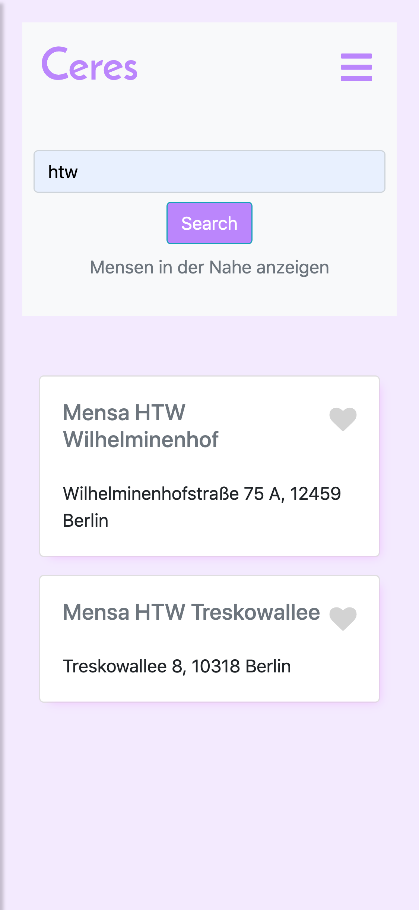
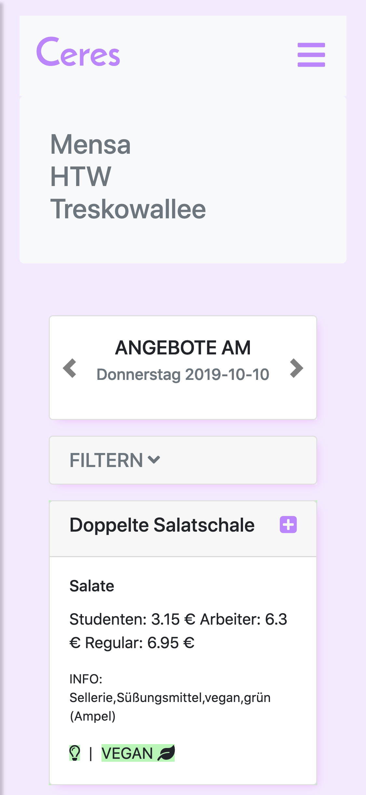

# Mensa Progressive Web App 

## Introduction
Project for the module Programming of Mobile Applications at the HTW Berlin, summer semester 2020.
Mensa data was retrieved from the web server https://doc.openmensa.org/api/v2/

## Live Example

Our app is online at http://mensa-app-g11.herokuapp.com/

## Installation

### Step 1: Clone this repo and serve it
Use the package manager [npm](https://www.npmjs.com) to install all dependencies from Mensa-App.

```bash
git clone https://github.com/thanhthuyvu/mensaapp.git
cd mensaapp
npm install # get the dependencies
node app.js # serves the folder at http://localhost:3000/ (port hardcoded)
```
### Step 2: Run A Browser with the port 3000:

http://localhost:3000

## Technologies

- HTML 
- CSS
- Bootstrap
- Node.Js
- Express.Js
- MongoDB

## Preview



